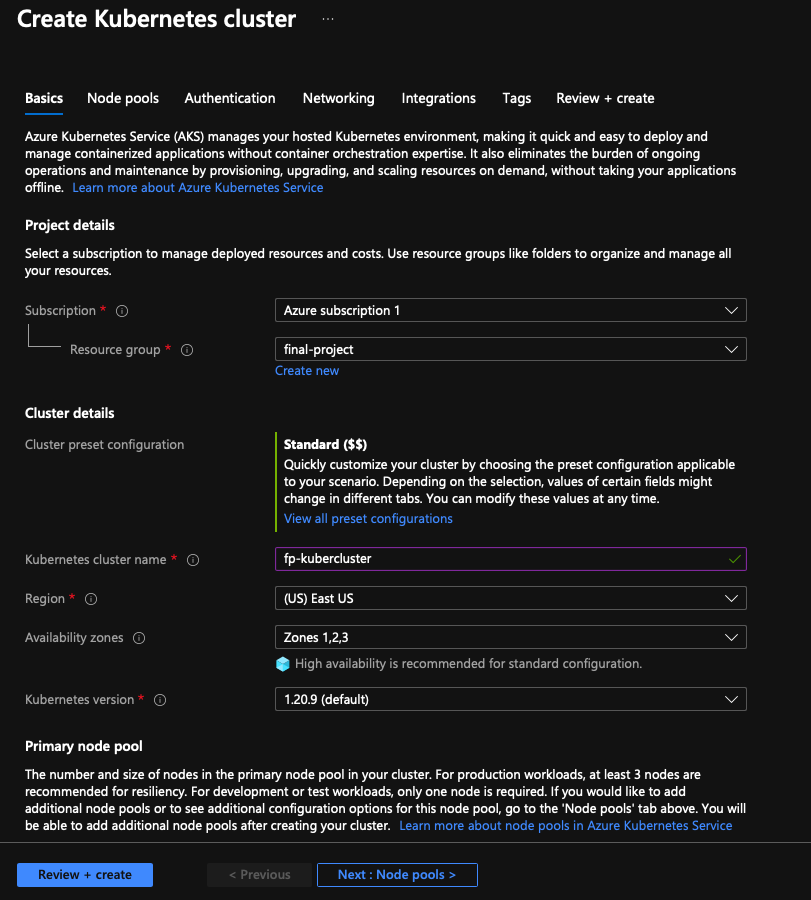
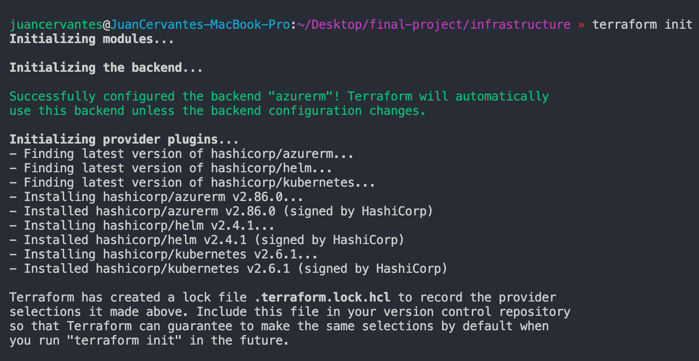
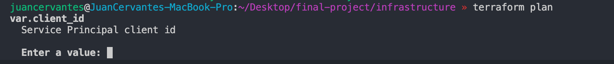
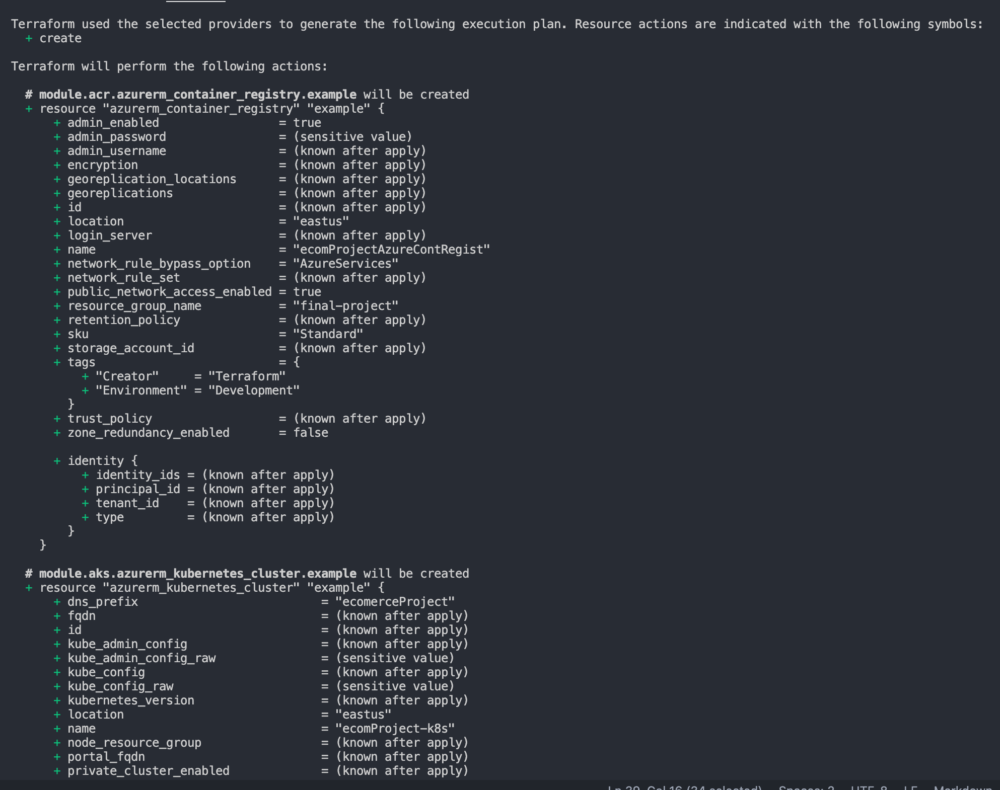

# User guide for the Infrastructure

In order to start working on this application we need to fork it [here](https://github.com/juanjodevops/microservices-demo)

## Prerequisites 

- Install Azure CLI
- Login using the command `az login`
- Creating a Resource Group in Azure

In this part I used a Resource Group created in the Azure portal.

- Resource Group: final-project
- Service Principal: fp-sp
- Storage Account: fpstorage

---

## Creating a Storage Account for Terraform storage

Due to the fact that Terraform state is stored locally, it is not ideal for the following reasons:

- Does not work well in a team enviroment
- Terraform can include sensitive information
- Storing state locally can increase the chances of deletion without a warning

## Create storage account
`az storage account create --resource-group <YOUR RESOURCE GROUP> --name <YOUR STORAGE ACCOUNT> --sku Standard_LRS --encryption-services blob`

## Create a Service Principal 
`az ad sp create-for-rbac --name <YOUR SERVICE PRINCIPAL> --role Contributor`

{
  "appId": "SAVE THIS FOR LATER",
  "displayName": "fp-sp",
  "name": "SAVE THIS FOR LATER",
  "password": "SAVE THIS FOR LATER",
  "tenant": "SAVE THIS FOR LATER"
}

---

# Authenticate Terraform to Azure

## View the account list
`az account list --query "[?user.name=='myemail.com'].{Name:name, ID:id, Default:isDefault}" --output Table`

## Use a specific Azure subscription 
`az account set --subscription "MY SUBSCRIPTION"`

## Specify service principal credentials in enviroment variables

export ARM_SUBSCRIPTION_ID="SAVE THIS FOR LATER"
export ARM_TENANT_ID="SAVE THIS FOR LATER"
export ARM_CLIENT_ID="SAVE THIS FOR LATER"
export ARM_CLIENT_SECRET="SAVE THIS FOR LATER"

## Get storage account key
`az storage account keys list --resource-group <YOUR RESOURCE GROUP> --account-name <YOUR STORAGE ACCOUNT>`

  {
    "creationTime": "2021-11-24T03:16:20.555358+00:00",
    "keyName": "key1",
    "permissions": "FULL",
    "value": "MY KEYS"
  },
  {
    "creationTime": "2021-11-24T03:16:20.555358+00:00",
    "keyName": "key2",
    "permissions": "FULL",
    "value": "MY KEYS"
  }
]

## Create blob container
`az storage container create --name <YOUR CONTAINER> --account-name <YOUR STORAGE ACCOUNT> --account-key $STORAGE_ACCOUNT_KEY`

## Create a Key Vault and store secret
`az keyvault create --name "<YOUR SECRET>" --resource-group "<YOUR RESOURCE GROUP>"`

`az keyvault secret set --vault-name "<YOUR KEY VAULT>" --name "<YOUR ACCESS KEY>" --value $STORAGE_ACCOUNT_KEY`

## With this command we can access the value
`az keyvault secret show --name "<YOUR ACCESS KEY>" --vault-name "<YOUR KEY VAULT>"  --query value -o tsv`

---

# Creating a Kubernetes Cluster

In this case, it was easier to create a Kubernetes Cluster from the Azure portal. 

---

# Terraform 

With our terraform file, we can manage and create our infrastructure as code in a safe way. 

We can start Terraform with the command `terraform init` and authenticate with our credentials. 

Once the Authentication is completed, terraform will show the current plan of your desired infrastructure using the command `terraform plan`. 

